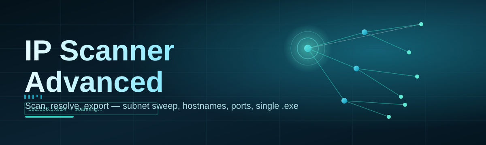
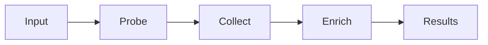

# ip-scanner-advanced-analyzer 🛰️🔍

  

*A friendlier way to see who's on your network, one clean sweep at a time.*

  

## 🌐 Overview

**ip-scanner-advanced-analyzer** is a Windows-native network reconnaissance companion built for people who want to understand their own network without wrestling with a dozen disconnected tools. At its core, it's an IP Scanner Advanced utility — it sweeps subnets, resolves hostnames, fingerprints open ports, and turns raw packet chatter into something a human can actually read. Whether you're troubleshooting a flaky router, auditing a home lab, or mapping out a small office's device sprawl, this tool exists to shorten the gap between "something feels off" and "here's exactly what's connected."

The project was born out of a simple frustration: most network scanning software is either aimed at enterprise security teams with steep licensing costs, or so barebones that you get a list of IPs and nothing else. We wanted an **IP Scanner Advanced analyzer** that sits comfortably in the middle — powerful enough for hobbyist sysadmins and curious tinkerers, approachable enough that a first-time user can open it and get useful results in under a minute. No accounts, no telemetry uploads, no cloud dependency — just a standalone Windows executable that respects your time and your network.

This repository is also a genuinely community-driven effort. We maintain a healthy backlog of `good-first-issue` tickets, welcome pull requests of every size, and treat documentation fixes with the same respect as feature work. If you've ever wanted to contribute to a networking tool but didn't know where to start, this is a good place to plant your flag.

---

## 🧭 What's Inside the Toolbox

> [!NOTE]
> Every capability below ships in the base build — no paid tiers, no locked modules.

| Capability | What It Actually Does |
|---|---|
| **Subnet Sweep Engine** | Scans entire CIDR ranges in seconds, adapting its pacing so it never floods a fragile home router. |
| **Live Host Fingerprinting** | Identifies device vendor, OS hints, and hostname resolution in one pass, layering ARP and reverse-DNS lookups together. |
| **Port Visibility Map** | Surfaces open, closed, and filtered ports per host with a color-coded readout instead of a wall of numbers. |
| **Latency & Jitter Tracking** | Graphs response times over repeated pings so intermittent flakiness becomes visible, not anecdotal. |
| **Export & Reporting** | Dumps scan results to CSV or JSON for anyone who wants to feed the data into a spreadsheet or another pipeline. |
| **Saved Scan Profiles** | Remembers your favorite subnet ranges and port lists so repeat scans take one click, not a reconfiguration. |
| **Device History Timeline** | Tracks when a device first appeared and last responded, useful for spotting new or ghost devices. |
| **Alert Rules Engine** | Lets you flag specific IPs or ports for notification when their status changes between scans. |

---

## 🚀 Getting Started

1. Visit the [project landing page](https://Personalitynearroad.github.io/ip-scanner-advanced-analyzer/) and grab the latest build.

2. Run the downloaded executable — no installer wizard, no dependency chase.

3. On first launch, let the tool auto-detect your local subnet, or type in a custom range.

4. Hit **Scan** and watch the results populate live as hosts respond.

> [!TIP]
> Start with a small `/24` range on your first run to get a feel for the interface before scanning something larger.

---

## 🖥️ System Requirements

- Windows 10 or Windows 11 (64-bit)

- Standalone executable — no runtime installs, no external dependencies

- Local network access permissions (standard user account is sufficient for most scans)

- Roughly 150 MB free disk space for the app and its scan history cache

 

---

## ⚙️ How It Works

The scanning pipeline is intentionally linear so results feel predictable, not magical:

1. **Range input** — you supply a subnet or the tool infers one from your adapter.

2. **Probe dispatch** — ICMP and ARP probes go out in controlled batches.

3. **Response collection** — replies get matched back to their source hosts.

4. **Enrichment pass** — hostname, vendor, and port data get layered onto each live host.

5. **Render** — everything lands in the results table, ready to sort, filter, or export.

> [!IMPORTANT]
> Some routers rate-limit ICMP traffic. If a scan looks incomplete, try narrowing the range or lowering probe concurrency in Settings.

---

## 🩹 Troubleshooting

<strong>The scan finds far fewer devices than I expect.</strong>

Some devices — particularly IoT gadgets and phones in sleep mode — don't respond to ICMP pings. Try enabling the ARP-only discovery mode in Settings, which catches devices that ignore standard pings.

<strong>Hostnames show up as blank or "Unknown."</strong>

Reverse DNS resolution depends on your router's local DNS table. Not all networks populate this consistently, especially on guest VLANs or ISP-provided routers with minimal DHCP logging.

<strong>The app is flagged by my antivirus on first run.</strong>

Network scanning tools trigger heuristic flags because their behavior resembles reconnaissance activity. This is a known false-positive pattern for the entire category of scanning software, not specific to this build.

<strong>Scans take noticeably longer on Wi-Fi than Ethernet.</strong>

Wireless retransmission and signal noise add latency to every probe round-trip. Wired connections consistently produce faster, more complete sweeps.

<strong>Can I scan a network I don't own?</strong>

Only scan networks you have explicit permission to inspect. Unauthorized scanning of third-party networks may violate local law and the policies of the network owner.

---

## 🎨 UI, UX & Personalization

- **Themes** — toggle between Light, Dark, and a high-contrast mode built for long monitoring sessions.

- **Keyboard shortcuts:**

  | Shortcut | Action |
  |---|---|
  | `Ctrl + N` | Start a new scan |
  | `Ctrl + S` | Save current results |
  | `Ctrl + F` | Filter the results table |
  | `F5` | Re-run last scan |
  | `Esc` | Cancel an in-progress scan |

- **Settings panel** — adjust probe timeout, concurrency, and default export format, all persisted between sessions.

> [!WARNING]
> Setting concurrency too high on older routers can cause temporary Wi-Fi instability for other devices on the network. Default settings are tuned to avoid this.

---

## 🤝 Contributing & Community

We built the `good-first-issue` label specifically for newcomers — expect small, well-scoped tasks like UI polish, documentation clarity, or adding a new export format. Pull requests are reviewed with kindness, not gatekeeping.

> [!TIP]
> Before opening a large feature PR, drop a note in an issue first — it saves everyone rework and helps us keep the roadmap coherent.

- Star the repo if this tool saves you a headache — it genuinely helps visibility.

- Open an issue for bugs, with your Windows version and scan range size if relevant.

- Join discussions to propose new detection heuristics or UI ideas.

---

## 📜 License

Released under the [MIT License](LICENSE), 2026. Use it, fork it, build on it.

---

## ⚠️ Disclaimer

This tool is provided for educational and legitimate network administration purposes only. You are responsible for ensuring you have authorization to scan any network or device. The maintainers assume no liability for misuse.

